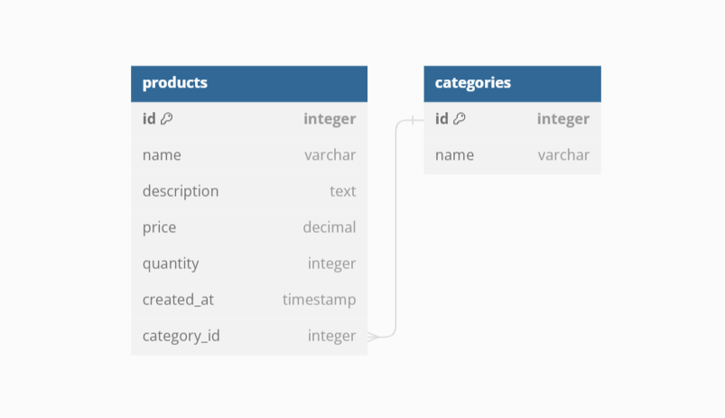

# fast-api-product

API service for managing products and product categories

## Technologies used

FastAPI, SQLite, SQlAlchemy, Alembic, Pydantic

## Features

Full CRUD for models Product and Category

## DB Structure



## How to run

### Prerequirements

Python 3.9+ (3.11 preferred) must be already installed

- Clone this github repo on your machine
``` shell
git clone https://github.com/ant-komarov/fast-api-product.git
cd fast-api-product
# Create and activate virtual environment
# for Windows:
python -m venv venv
venv\Scripts\activate
# for Mac, Linux:
python3 -m venv venv
source venv/bin/activate
# Install all requirement packages:
pip install -r requirements.txt
# Apply migrations for DB:
alembic upgrade head
# Run app:
uvicorn main:app --reload
```
You can use integrated Swagger documentation to try app.  
Swagger documentation available at http://127.0.0.1:8000/docs

Also you can use prepared Postman-collection(FastAPI product API.postman_collection.json) from root directory for testing app.
